SmartPeak
##########################################################################################################
.. begin_introduction

SmartPeak is an application that encapsulates advanced algorithms to enable fast, accurate, and automated processing of CE-, GC- and LC-MS(/MS) data, and HPLC data for targeted and semi-targeted metabolomics, lipidomics, and fluxomics experiments. The software is based on the OpenMS toolkit.

SmartPeak provides graphical- and/or command-line-based user input validation, workflow configuration, data visualization and review, logging, and reporting. SmartPeak can be run on multiple operating systems or run on cloud infrastructures. The workflow automates all steps from peak detection and integration over calibration curve optimization, to quality control reporting.

.. end_introduction

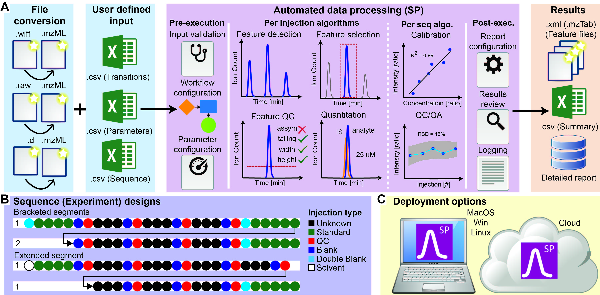

.. role:: bash(code)
   :language: bash

Building from source
==========================================================================================================

Windows
----------------------------------------------------------------------------------------------------------

STEP 1: Build OpenMS dependencies
~~~~~~~~~~~~~~~~~~~~~~~~~~~~~~~~~
Build OpenMS-contrib by following the OpenMS wiki instructions

Download and install the pre-compiled Boost library binaries for windows
- Ensure that these binaries are used both for OpenMS and SmartPeak
- The only boost package required by SmartPeak is Unit Test for unit testing, however, the same version of boost must be used when compiling both OpenMS and SmartPeak

Download and install QT5 using the offline installer for windows
- NOTE: only install the 5.12.1 for the relevant version of visual studios
- Add the "lib" folder in the newly created qt5 directory to the system path variable so that the .dll's will be found during run-time
- or add e.g. :bash:`PATH=%PATH%;C:/qt/Qt5.12.1b/5.12.1/msvc2017_64/bin;C:/local/boost_1_67_0/lib64-msvc-14.1` to the environment

STEP 2: Build OpenMS
~~~~~~~~~~~~~~~~~~~~~~~~~~~~~~~~~
Build OpenMS following the OpenMS wiki instructions. Example cmake command on windows

.. code-block:: bash

    cmake -DBoost_NO_SYSTEM_PATHS=ON -BOOST_INCLUDEDIR="C:/local/boost_1_67_0/boost" -DBOOST_ROOT="C:/local/boost_1_67_0" ^
    -DBOOST_LIBRARYDIR="C:/local/boost_1_67_0/lib64-msvc-14.1" -DBOOST_USE_STATIC=OFF -DWITH_GUI=OFF -DPYOPENMS=OFF ^
    -DOPENMS_CONTRIB_LIBS="[OpenMS directory]/contrib/build" -DCMAKE_PREFIX_PATH="C:/qt/Qt5.12.1b/5.12.1/msvc2017_64/lib/cmake" ^
    -G "Visual Studio 15 2017 Win64" ..

- Open "OpenMS_host" in visual studios and build only the solution for "OpenSwathAlgo" and then for "OpenMS" IN THAT ORDER
- Add the "lib" folder in the openms-build directory to the system path variable so that the .dll's will be found during run-time
- or add :bash:`PATH=%PATH%;[OpenMS directory]/openms-build/bin/debug;C:/qt/Qt5.12.1b/5.12.1/msvc2017_64/bin;C:/local/boost_1_67_0/lib64-msvc-14.1;[SDL directory]/lib/x64` to the environment

STEP 3: Build SmartPeak dependencies
~~~~~~~~~~~~~~~~~~~~~~~~~~~~~~~~~
Download the latest SDL2 libraries. Add the SDL2 folder to the path environmental variable. Compile using cmake and build for "external projects"
Example cmake command to download all external projects assuming that you are in the location :code:`[home directory]/smartPeak2/build_external`
:bash:`cmake -G "Visual Studio 15 2017 Win64" -T host=x64 -DUSE_SUPERBUILD=ON ..`
However, many of the requirements overlap with OpenMS so for practical purposes the only libraries that will need to be download are "ImGui", "ImPlot", and "Plog"

STEP 4: Build SmartPeak
~~~~~~~~~~~~~~~~~~~~~~~~~~~~~~~~~
Compile using cmake.
Example cmake command on windows assuming that all external dependency libraries are in the path :code:`[home directory]/smartPeak2/build_external`

.. code-block:: bash

    cmake -DEIGEN_USE_GPU=OFF -DBoost_NO_SYSTEM_PATHS=ON -BOOST_INCLUDEDIR="C:/local/boost_1_67_0/boost" -DBOOST_ROOT="C:/local/boost_1_67_0" ^
    -DBOOST_LIBRARYDIR="C:/local/boost_1_67_0/lib64-msvc-14.1" -DBOOST_USE_STATIC=OFF -G "Visual Studio 15 2017 Win64" -T host=x64 -DUSE_SUPERBUILD=OFF ^
    -DEIGEN3_INCLUDE_DIR=[home directory]/smartPeak2/build_external/Dependencies/Source/eigen ^
    -DPLOG_INCLUDE_DIR=[home directory]/smartPeak2/build_external/Dependencies/Source/plog/include ^
    -DIMGUI_DIR=[home directory]/smartPeak2/build_external/Dependencies/Source/imgui ^
    -DIMPLOT_DIR=[home directory]/smartPeak2/build_external/Dependencies/Source/implot ^
    -DCMAKE_PREFIX_PATH="[OpenMS directory]/openms-build";"C:/qt/Qt5.12.1b/5.12.1/msvc2017_64/lib/cmake";"[SDL directory]/SDL"; ..

Open "SmartPeak2_host" in visual studios and build the project of choice. Projects can be built using Visual Studios in the IDE by opening :code:`msbuild [build_dir]/src/SmartPeak2_host` and selecting the specific target to build in the GUI or on the command line by running e.g., `msbuild [build_dir]/src/smartpeak/SmartPeak.sln /verbosity:normal /maxcpucount` which will build the main SmartPeak library and then running e.g., `msbuild [build_dir]/examples/SmartPeak_class_examples_smartpeak.sln -target:GUI /verbosity:normal /maxcpucount` which will build the SmartPeak GUI.

Linux
----------------------------------------------------------------------------------------------------------
In the below instructions it is assumed OpenMS code resides in  :code:`~/OpenMS` and SmartPeak code is in :code:`~/SmartPeak2`.

STEP 1: Build OpenMS dependencies
~~~~~~~~~~~~~~~~~~~~~~~~~~~~~~~~~
Build OpenMS-contrib by following the OpenMS wiki instructions.

Starting from ``Ubuntu 18.04``, it's not necessary to manually build ``OpenMS' contrib``. The packages available in the repositories are recent enough.

STEP 2: Build OpenMS
~~~~~~~~~~~~~~~~~~~~~~~~~~~~~~~~~
Build OpenMS following the OpenMS wiki instructions.
Example workflow:

.. code-block:: bash

    cd ~
    mkdir OpenMS-build
    cd OpenMS-build
    cmake -DBOOST_USE_STATIC=OFF -DHAS_XSERVER=OFF -DWITH_GUI=OFF -DENABLE_TUTORIALS=OFF -DENABLE_DOCS=OFF -DGIT_TRACKING=OFF -DENABLE_UPDATE_CHECK=OFF -DCMAKE_BUILD_TYPE=Debug -DPYOPENMS=OFF -DOPENMS_COVERAGE=OFF ~/OpenMS
    make -j4 OpenMS

STEP 3: Building SmartPeak
~~~~~~~~~~~~~~~~~~~~~~~~~~~~~~~~~
SuperBuild helps downloading the dependencies for SmartPeak. 

.. code-block:: bash

    cd ~
    mkdir SmartPeak2_superbuild SmartPeak2_build
    cd SmartPeak2_superbuild
    cmake -DUSE_SUPERBUILD=ON -G "Unix Makefiles" -DCMAKE_BUILD_TYPE=Debug ~/SmartPeak2
    make -j4
    cd ~/SmartPeak2_build
    cmake -DEIGEN_USE_GPU=OFF -DUSE_SUPERBUILD=OFF -DBOOST_USE_STATIC=OFF -G "Unix Makefiles" -DCMAKE_PREFIX_PATH=$HOME/OpenMS-build/ -DPLOG_INCLUDE_DIR=$HOME/SmartPeak2_superbuild/Dependencies/Source/plog/include -DIMGUI_DIR=$HOME/SmartPeak2_superbuild/Dependencies/Source/imgui -DIMPLOT_DIR=$HOME/SmartPeak2_superbuild/Dependencies/Source/implot -DCMAKE_BUILD_TYPE=Debug ~/SmartPeak2
    make -j4

Some dependencies one might have to install:

.. code-block:: bash
    sudo apt install qt5-default libboost-dev libeigen3-dev libxerces-c-dev coinor-libcbc-dev libsvm-dev libboost-iostreams-dev libboost-date-time-dev libboost-math-dev libwildmagic-dev libsqlite3-dev libglpk-dev seqan-dev libhdf5-dev

Running the tests
----------------------------------------------------------------------------------------------------------

The tests are run with ``ctest`` command.

.. code-block:: bash
    ctest

In order to run a specific test, use ``-R`` option and the test class name (without ``.cpp`` extension)

.. code-block:: bash
    ctest -R Utilities_test

Running the examples
^^^^^^^^^^^^^^^^^^^^^^^^^^^^^^^^^

The collection of examples is located at `src/example/data` directory of the SmartPeak source code. The directory contains examples of different kinds of data in `.mzML` format and their corresponding configuration files.

Using GUI
~~~~~~~~~~~~~~~~~~~~~~~~~~~~~~~~~

- To start the GUI, from the build directory run

.. code-block:: bash
    ./bin/GUI

for Mac and Linux, or

.. code-block:: bash
    ./bin/[Debug or Release]/GUI

for Windows.
or double-click ``GUI`` executable in the file browser of your OS.
- Start the session with `File | Load session from sequence`
- Choose the corresponding directory with `Change dir`. The path to example folder can be shortened to f.e. `/data/GCMS_SIM_Unknowns` 
- Select the sequence file

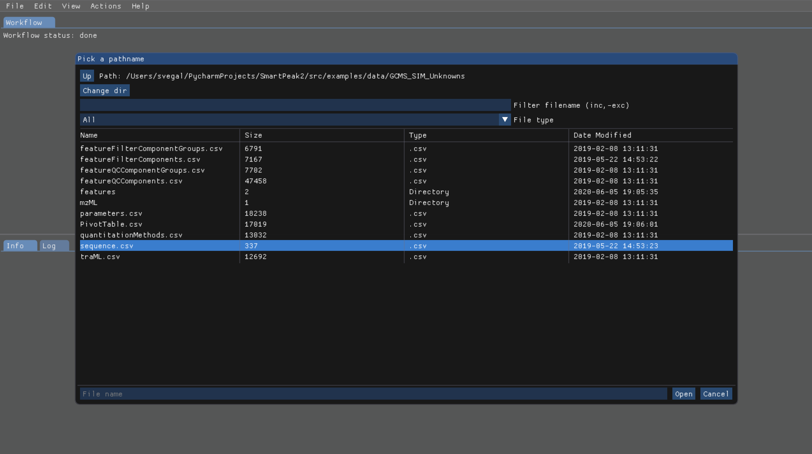

- The integrity of the loaded data can be checked with `Actions | Integrity checks`.  The results of the integrity checks can be viewed with `View | Info`.
- Edit the workflow with `Edit | Workflow`. You have an option to cherry pick the custom workflow or to choose the predefined set of operations. For example, the workflow steps for GC-MS SIM Unknowns are the following:

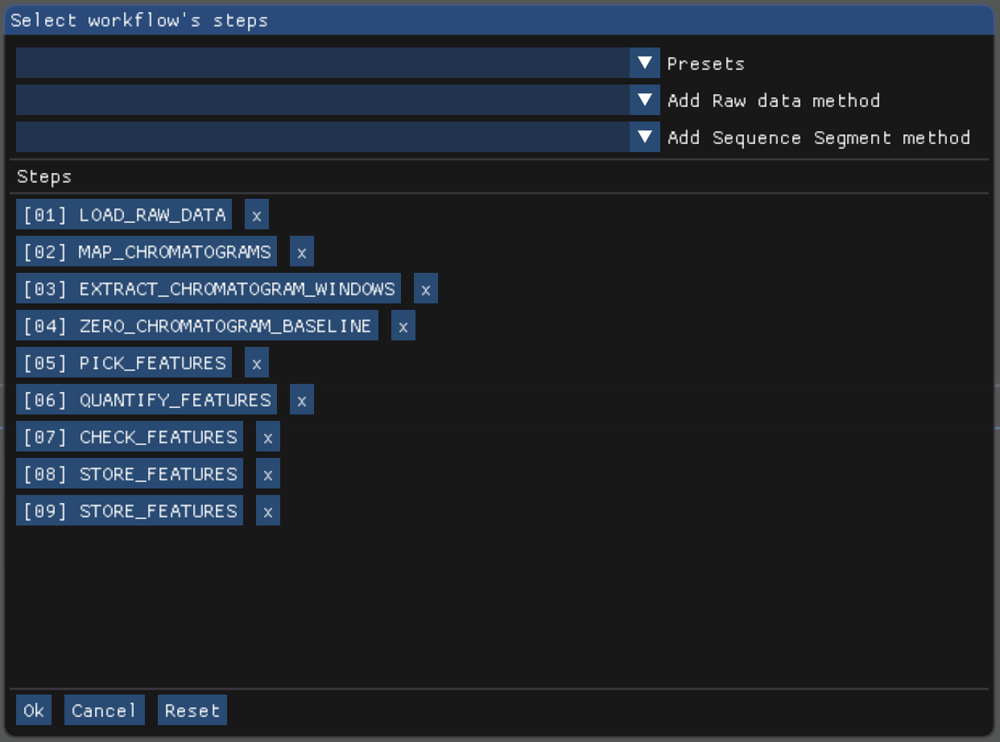

- View and verify the workflow steps and input files with `View | [table]`. 

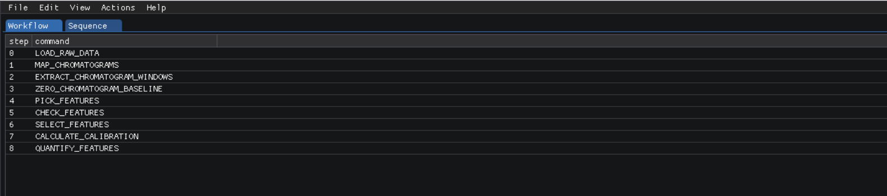

- The explorer panes can be used to filter the table views with `View | Injections or Transitions`.  Click on the checkbox under plot or table to include or exclude the injection or tansition from the view.

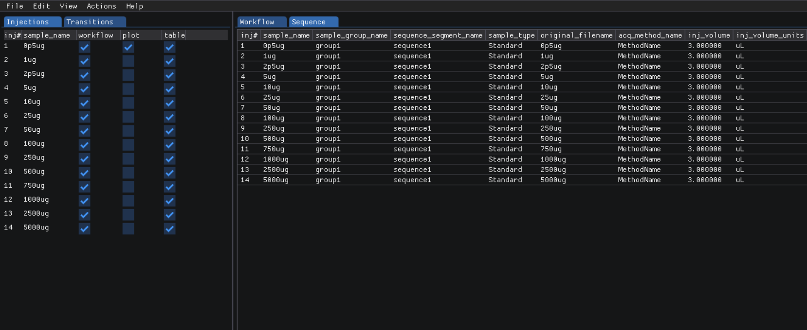

- Changes to any of the input files can be made by reloading a modified .csv version of the file with `File | Import File`.
- Run the workflow with `Actions | Run workflow`. Verify or change the data input/output directories before running the workflow.

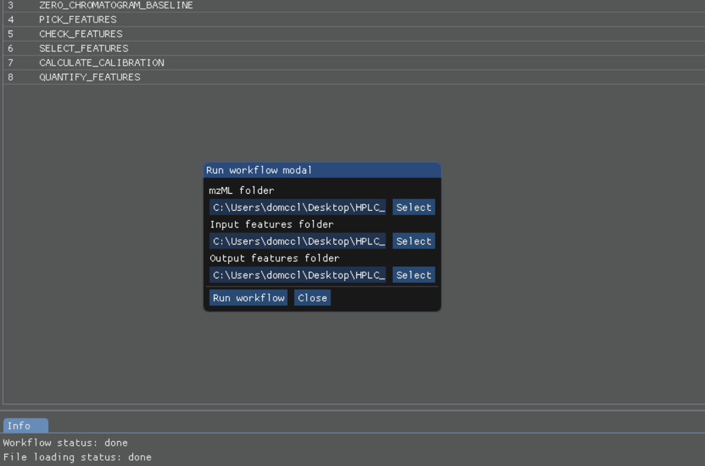

- The status of the workflow can be monitored with `View | info`. 

.. |Info| image:: images/SmartPeakGUIInfo.png)

- Alternatively, a more detailed status can be obtained with `View | log` which will display the most recent SmartPeak log information.

.. |Log| image:: images/SmartPeakGUILog.png)

- After the workflow has finished, the results can be viewed in a tabular form as a large data table with `View | features (table)`.  The feature metavalues shown can be added or removed with `View | Features` and clicking on the checkboxes under plot or table.  For performance reasons, the amount of data that one can view is limited to 5000 entries.

- The results can be viewed in a graphical form as a line plot or as a heatmap with `View | features (line)`.

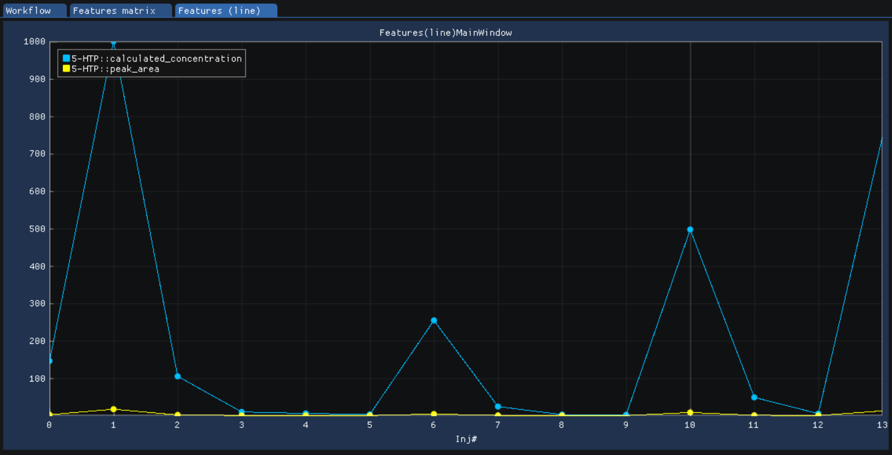

or `View | features (heatmap)`

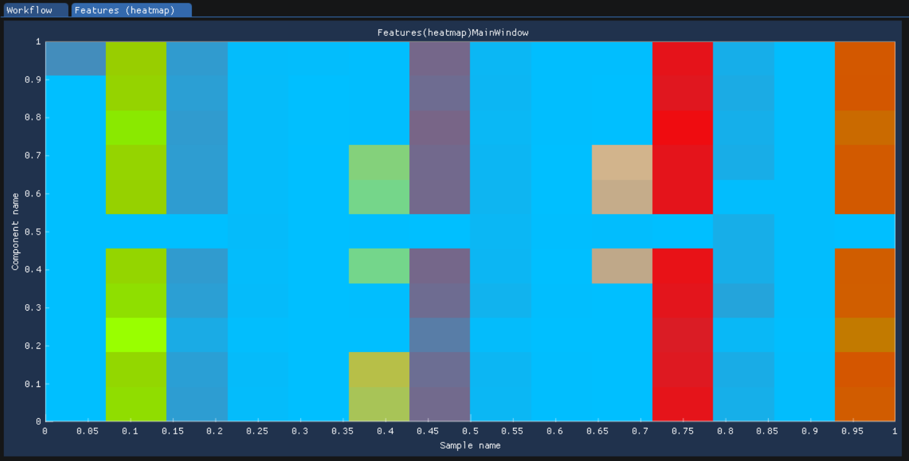

- The underlying data can also be displayed as a table matrix with `View | features (matrix)`. Samples, transitions, or feature metavalues can be included or excluded from any of the views using the explorer panes.

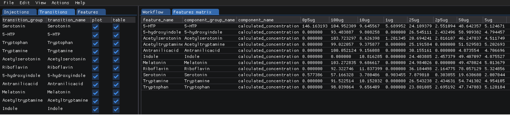

- The results of calibration curve fitting can be inspected with `View | Workflow settings | Quant Methods`.

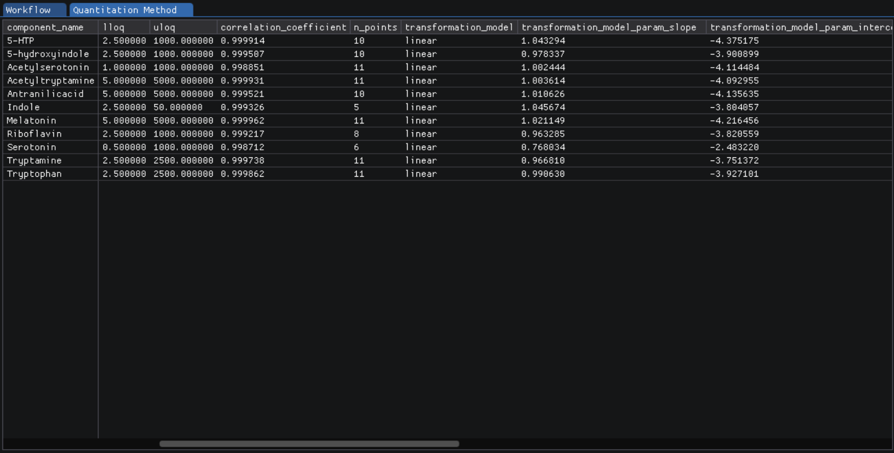

- A detailed look at the calibration fitted model and selected points for the model can be seen with `View | Calibrators`.

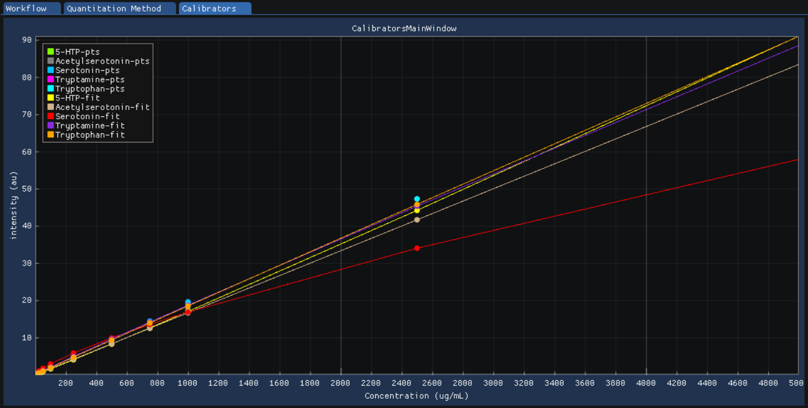

- For debugging problematic peaks, the raw chromatographic data and the picked and selected peaks can be viewed graphically with `View | Chromatograms`. For performance reasons, the amount of data that one can view is limited to 9000 points.

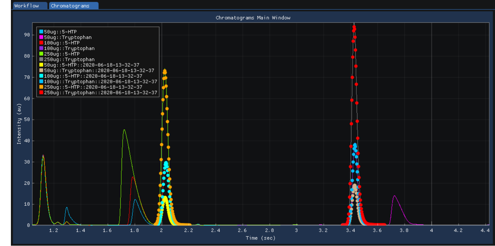

- Export the results with `Actions | Report`. There is an option to choose the set of variables of interest

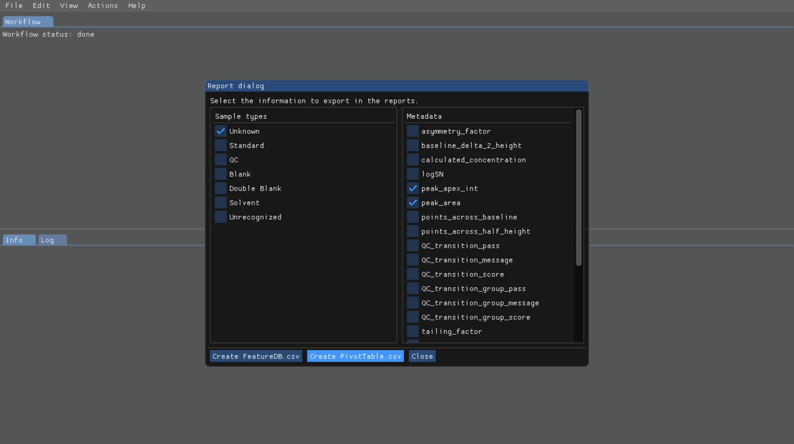

- The results will be exported to `PivotTable.csv` in the same folder

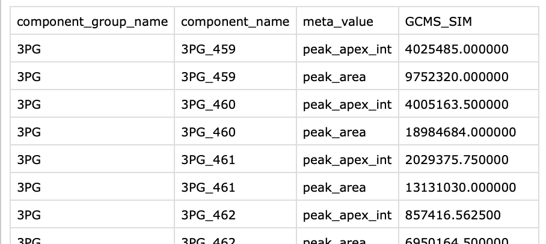

The above applies for Mac and Linux.