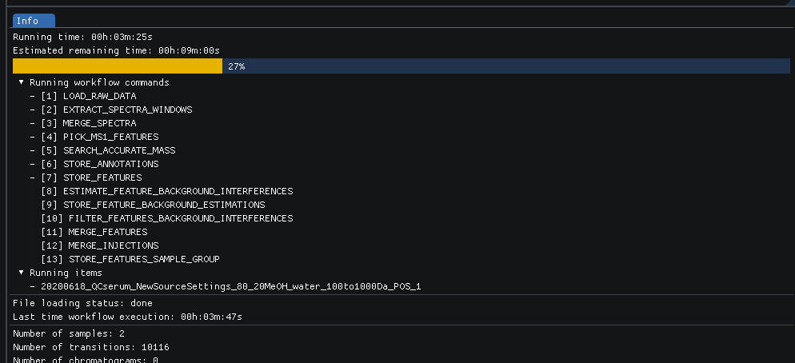

SmartPeak
##########################################################################################################
|docs| |circleci| |license|

.. begin_badges

.. |docs| image:: https://readthedocs.com/projects/smartpeak/badge/?version=latest
   :alt: Documentation Status
   :target: https://smartpeak.readthedocs.io/en/latest/?badge=latest

.. |circleci| image:: https://circleci.com/gh/AutoFlowResearch/SmartPeak.svg?branch=develop?style=svg
   :alt: CircleCI Build Status (Windows, Linux & macOS)
   :target: https://circleci.com/gh/AutoFlowResearch/SmartPeak

.. |license| image:: https://img.shields.io/github/license/AutoFlowResearch/SmartPeak.svg
   :alt: License MIT Clause
   :target: https://github.com/AutoFlowResearch/SmartPeak/blob/develop/LICENSE

.. end_badges

.. begin_introduction

SmartPeak is an application that encapsulates advanced algorithms to enable fast, accurate, and automated processing of CE-, GC- and LC-MS(/MS) data, and HPLC data for targeted and semi-targeted metabolomics, lipidomics, and fluxomics experiments. The software is based on the OpenMS toolkit.

SmartPeak provides graphical- and/or command-line-based user input validation, workflow configuration, data visualization and review, logging, and reporting. SmartPeak can be run on multiple operating systems or run on cloud infrastructures. The workflow automates all steps from peak detection and integration over calibration curve optimization, to quality control reporting.

.. end_introduction

.. image:: images/Fig01_SmartPeak_overview.jpg

.. role:: bash(code)
   :language: bash

Building from source
==========================================================================================================

To compile SmartPeak from sources, use the circleci script as a guide. The circleci script can be found in .circleci/config.yml and the 3 builds Windows, Linux and MacOS are supported here.

.. begin_runningtests

Running the tests
----------------------------------------------------------------------------------------------------------

The tests are run with ``ctest`` command.

.. code-block:: bash

    ctest

In order to run a specific test, use ``-R`` option and the test class name (without ``.cpp`` extension)

.. code-block:: bash

    ctest -R Utilities_test

.. end_runningtests

.. begin_runningexamples

Running the examples
~~~~~~~~~~~~~~~~~~~~~~~~~~~~~~~~~

The collection of examples is located at ``src/example/data`` directory of the SmartPeak source code. The directory contains examples of different kinds of data in ``.mzML`` format and their corresponding configuration files.

.. end_runningexamples

.. begin_logging

Log path
~~~~~~~~~~~~~~~~~~~~~~~~~~~~~~~~~
Default locations of logs:

- Windows: ``C:\\Users\\<user>\\AppData\\Local\\SmartPeak``
- Linux and MacOS: ``~/.SmartPeak``

User can change default location and specify directory where the logs are stored by setting ``SMARTPEAK_LOGS`` env variable. 
If directory specified by the path doesn't exist, SmartPeak will create it.

.. end_logging

.. begin_gui

Using SmartPeak GUI
~~~~~~~~~~~~~~~~~~~

- After successful installation of SmartPeak, on Windows open menu start and browse for relevant icon, you can also find the shortcut on desktop.
- If built SmartPeak from the source code, from the build directory run :bash:`./bin/SmartPeakGUI` for Mac and Linux, or :bash:`./bin/[Debug or Release]/SmartPeakGUI` for Windows. Or double-click ``SmartPeakGUI`` executable in the file browser of your OS.
- Start the session with ``File | Load session from sequence``
- Choose the corresponding directory with ``Change dir``. The path to example folder can be shortened to f.e. ``/data/GCMS_SIM_Unknowns`` 
- Select the sequence file

- The integrity of the loaded data can be checked with ``Actions | Integrity checks``.  The results of the integrity checks can be viewed with ``View | Info``.
- Edit the workflow with ``Edit | Workflow``. You have an option to cherry pick the custom workflow or to choose the predefined set of operations. For example, the workflow steps for GC-MS SIM Unknowns are the following:

.. image:: images/workflow.png

- View and verify the workflow steps and input files with ``View | [table]``. 

- The explorer panes can be used to filter the table views with ``View | Injections or Transitions``.  Click on the checkbox under plot or table to include or exclude the injection or tansition from the view.

.. image:: images/SmartPeakGUISequenceTable.png

- Changes to any of the input files can be made by reloading a modified .csv version of the file with ``File | Import File``.
- Run the workflow with ``Actions | Run workflow``. Verify or change the data input/output directories before running the workflow.

.. image:: images/SmartPeakGUIRunWorkflowModal.png

- The status of the workflow can be monitored with ``View | info``. An estimated time is available. This value is only a rough estimation. It will be updated regaluary while the workflow is running. The progress bar however shows workflow steps completed. As some steps can be longer to execute, it may not reflect remaining time. More details are available about the items that are currently running.

- Alternatively, a more detailed status can be obtained with ``View | log`` which will display the most recent SmartPeak log information.

.. image:: images/SmartPeakGUILog.png

- After the workflow has finished, the results can be viewed in a tabular form as a large data table with ``View | features (table)``.  The feature metavalues shown can be added or removed with ``View | Features`` and clicking on the checkboxes under plot or table.  For performance reasons, the amount of data that one can view is limited to 5000 entries.

- The results can be viewed in a graphical form as a line plot or as a heatmap with ``View | features (line)``.

.. image:: images/SmartPeakGUIFeatureLinePlot.png

or ``View | features (heatmap)``

- The underlying data can also be displayed as a table matrix with ``View | features (matrix)``. Samples, transitions, or feature metavalues can be included or excluded from any of the views using the explorer panes.

.. image:: images/SmartPeakGUIFeatureMatrix.png

- The results of calibration curve fitting can be inspected with ``View | Workflow settings | Quant Methods``.

.. image:: images/SmartPeakGUIQuantMethod.png

- A detailed look at the calibration fitted model and selected points for the model can be seen with ``View | Calibrators``.

- For debugging problematic peaks, the raw chromatographic data and the picked and selected peaks can be viewed graphically with ``View | Chromatograms``. For performance reasons, the amount of data that one can view is limited to 9000 points.

.. image:: images/SmartPeakGUIChromViewer.png

- Export the results with ``Actions | Report``. There is an option to choose the set of variables of interest

.. image:: images/report_dialog.png

- The results will be exported to ``PivotTable.csv`` in the same folder

The above applies for Mac and Linux.

.. end_gui
