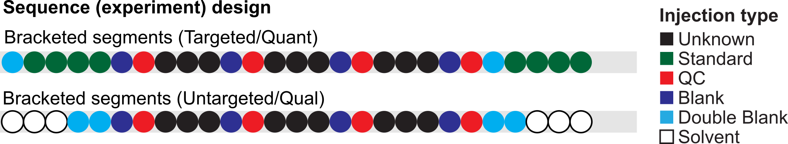

FAQ
===

This is a list of Frequently Asked Questions about SmartPeak.

.. _sample-types

What types of experiments does SmartPeak support?
-------------------------------------------------

SmartPeak supports various types of analytical chemistry experimental designs.  The experimental designs are specified in the sequence file by the ordering and grouping of sample types.  

An example of a sequence for a bracketed experimental design common to targeted quantification experiments is provided below.

Bracketed sequence
~~~~~~~~~~~~~~~~~~

.. list-table::
    :widths: 25 75
    :header-rows: 1

    * - sample_name
      - sample_type
      - sample_group_name
      - sequence_segment
    * - blank-1
      - Blank
      - blank-1
      - segment-1
    * - standard-1-low
      - Standard
      - standard-1
      - segment-1
    * - standard-1-medium
      - Standard
      - standard-1
      - segment-1
    * - standard-1-high
      - Standard
      - standard-1
      - segment-1
    * - sample-1-rep-1
      - Unknown
      - sample-1
      - segment-1
    * - sample-1-rep-2
      - Unknown
      - sample-1
      - segment-1
    * - sample-1-rep-3
      - Unknown
      - sample-1
      - segment-1
    * - blank-1
      - Blank
      - blank-1
      - segment-1
    * - standard-2-low
      - Standard
      - standard-2
      - segment-1
    * - standard-2-medium
      - Standard
      - standard-2
      - segment-1
    * - standard-2-high
      - Standard
      - standard-1
      - segment-1

All Blank, QC, Standard, and Unknown sample types that are a part of the same `sequence segment` are processed together.  This means that e.g., `background estimation`, `QC variance calculations`, and `quantitation method calculations` are calculated based off of the samples that are in the same `sequence segment` and applied to the samples in the same `sequence segment`.

The different sample types that can be specified by the user are given below.

Sample types
~~~~~~~~~~~~

.. list-table::
    :widths: 25 75
    :header-rows: 1

    * - Type
      - Description
    * - Unknown
      - Normal samples of unknown concentration
    * - Standard
      - Samples of known concentration. These samples are used for the creation of the calibration curve.
    * - QC
      - Quality Controls. SmartPeak supports two types of quality control samples: 1) analytical controls and 2) process controls.  Analytical controls are samples of known concentration are used to check the accuracy of the calibration curve but do not influence its actual construction.  Process controls are a mix of biological replicates that are representative of the dataset and that are injected at standard intervals to estimate the variance given in the same matrix during the run.
    * - Blank
      - These are generally samples containing the internal standard compounds, if used, but no analytes, and which have been through the normal sample preparation procedure.
    * - Double Blank
      - These are samples with neither internal standards nor analytes.
    * - Solvent
      - These are double blanks that have not been through the normal sample work-up procedure.
    * - Unrecognized
      - User specified sample type that is not recognized by SmartPeak.
      
.. _workflow-commands:

What are the different types of data processing workflows that SmartPeak supports?
----------------------------------------------------------------------------------

SmartPeak supports data processing workflows for quantitation, phenotyping, and discovery analytical chemistry applications.  Specifically, single reaction monitoring (SRM), single ion monitoring (SIM), full scan, data-dependent acquisition with product ion scans based off of SRM or full scan survey scans, and data-dependent acquisition (e.g., SWATH) with or without liquid or gas chromatography are supported.  High performance liquid chromatography (HPLC) with refractive index (RI) or ultra violet (UV) detection are also supported.  Data processing preset workflow for each of the supported workflows are available in SmartPeak.  The preset workflows can be customized by the user and saved for later re-use.  The available workflow steps are listed below.

Raw Data Methods
~~~~~~~~~~~~~~~~

.. list-table:: 
    :widths: 25 75
    :header-rows: 1

    * - Type
      - Description
    * - LOAD_RAW_DATA
      - Read in raw data mzML file from disk.
    * - LOAD_FEATURES
      - Read in the features from disk.
    * - PICK_MRM_FEATURES
      - Run the peak picking algorithm for SRMs/MRMs.
    * - FILTER_FEATURES
      - Filter transitions and transitions groups based on a user defined criteria.
    * - SELECT_FEATURES
      - Run the peak selection/alignment algorithm.
    * - VALIDATE_FEATURES
      - Compare selected features to a reference data set.
    * - QUANTIFY_FEATURES
      - Apply a calibration model defined in quantitationMethods to each transition.
    * - CHECK_FEATURES
      - Flag and score transitions and transition groups based on a user defined criteria.
    * - STORE_FEATURES
      - Write the features to disk.
    * - MAP_CHROMATOGRAMS
      - Map chromatograms to the loaded set of transitions.
    * - ZERO_CHROMATOGRAM_BASELINE
      - Normalize the lowest chromatogram intensity to zero.
    * - EXTRACT_CHROMATOGRAM_WINDOWS
      - Extract out specified chromatogram windows using the componentFeatureFilters.
    * - FIT_FEATURES_EMG
      - Reconstruct a peak from available data points.
    * - FILTER_FEATURES_RSDS
      - Filter transitions and transitions groups based on a user defined criteria.
    * - CHECK_FEATURES_RSDS
      - Flag and score transitions and transition groups based on a user defined criteria.
    * - FILTER_FEATURES_BACKGROUND_INTERFERENCES
      - Filter transitions and transitions groups based on a user defined criteria.
    * - CHECK_FEATURES_BACKGROUND_INTERFERENCES
      - Flag and score transitions and transition groups based on a user defined criteria.
    * - EXTRACT_SPECTRA_WINDOWS
      - Extract out specified spectra windows based on the user parameters.
    * - MERGE_SPECTRA
      - Merge all spectra along the time axis.
    * - PICK_2D_FEATURES
      - Run the peak picking algorithm for MS1 spectra.
    * - PICK_3D_FEATURES
      - Pick 3D Features.
    * - SEARCH_ACCURATE_MASS
      - Run the accurate mass search algorithm.
    * - MERGE_FEATURES
      - Create merged features from accurate mass search results.
    * - LOAD_ANNOTATIONS
      - Read in the annotations from disk.
    * - STORE_ANNOTATIONS
      - Write the annotations to disk.
    * - CLEAR_DATA
      - Clear raw and processed data.
    * - STORE_RAW_DATA
      - Store the processed raw data mzML file to disk.
    * - CALCULATE_MDVS
      - Calculate MDVs.
    * - ISOTOPIC_CORRECTIONS
      - Perform Isotopic Corrections.
    * - CALCULATE_MDV_ISOTOPIC_PURITIES
      - Calculate MDV Isotopic Purities.
    * - CALCULATE_MDV_ACCURACIES
      - Compare MDVs to Theoretical.

Sequence Segment Methods
~~~~~~~~~~~~~~~~~~~~~~~~

.. list-table:: 
    :widths: 25 75
    :header-rows: 1

    * - Type
      - Description
    * - CALCULATE_CALIBRATION
      - Determine the optimal relationship between known sample concentration and measured intensity.
    * - STORE_QUANTITATION_METHODS
      - Write each transitions calibration model to disk for later use.
    * - LOAD_QUANTITATION_METHODS
      - Load each transitions calibration model defined in quantitationMethods from disk.
    * - ESTIMATE_FEATURE_FILTER_VALUES
      - Estimate default FeatureQC parameter values for the feature filters from Standard and QC samples.
    * - ESTIMATE_FEATURE_QC_VALUES
      - Estimate default FeatureQC parameter values for the feature QCs from Standard and QC samples.
    * - TRANSFER_LOQ_TO_FEATURE_FILTERS
      - Transfer the upper (u)/lower (l) limits of quantitation (LOQ) values from the quantitation methods to the calculated concentration bounds of the feature filters.
    * - TRANSFER_LOQ_TO_FEATURE_QCS
      - Transfer the upper (u)/lower (l) limits of quantitation (LOQ) values from the quantitation methods to the calculated concentration bounds of the feature filters.
    * - ESTIMATE_FEATURE_RSDS
      - Estimate the %RSD for component and component group feature filter attributes from pooled QC samples.
    * - ESTIMATE_FEATURE_BACKGROUND_INTERFERENCES
      - Estimate the %BackgroundInterferences for component and component group feature filter ion intensity attributes from Blank samples.
    * - STORE_FEATURE_FILTERS
      - Store the component and component group filters to disk.
    * - LOAD_FEATURE_FILTERS
      - Load the component and component group filters from file.
    * - STORE_FEATURE_QCS
      - Store the component and component group QCs to disk.
    * - LOAD_FEATURE_QCS
      - Load the component and component group QCs from file.
    * - STORE_FEATURE_RSD_FILTERS
      - Store the component and component group percent RSD filters to disk.
    * - LOAD_FEATURE_RSD_FILTERS
      - Load the component and component group percent RSD filters from file.
    * - STORE_FEATURE_RSD_QCS
      - Store the component and component group percent RSD QCs to disk.
    * - LOAD_FEATURE_RSD_QCS
      - Load the component and component group percent RSD QCs from file.
    * - STORE_FEATURE_BACKGROUND_FILTERS
      - Store the component and component group percent Background Interference filters to disk.
    * - LOAD_FEATURE_BACKGROUND_FILTERS
      - Load the component and component group percent Background Interference filters from file.
    * - STORE_FEATURE_BACKGROUND_QCS
      - Store the component and component group percent Background Interference QCs to disk.
    * - LOAD_FEATURE_BACKGROUND_QCS
      - Load the component and component group percent Background Interference QCs from file.
    * - STORE_FEATURE_RSD_ESTIMATIONS
      - Store the component and component group percent RSD estimations to disk.
    * - LOAD_FEATURE_RSD_ESTIMATIONS
      - Load the component and component group percent RSD estimations from file.
    * - STORE_FEATURE_BACKGROUND_ESTIMATIONS
      - Store the component and component group percent Background Interference estimations to disk.
    * - LOAD_FEATURE_BACKGROUND_ESTIMATIONS
      - Load the component and component group percent Background Interference estimations from file.

Sample Group Methods
~~~~~~~~~~~~~~~~~~~~

.. list-table:: 
    :widths: 25 75
    :header-rows: 1

    * - Type
      - Description
    * - MERGE_INJECTIONS
      - Merge multiple injections of the same sample.
    * - LOAD_FEATURES_SAMPLE_GROUP
      - Load the features for the sample group.
    * - STORE_FEATURES_SAMPLE_GROUP
      - Store the features for the sample group.

.. _metadata:

What types of feature metadata does SmartPeak record?
-----------------------------------------------------

Various feature metadata is calculated and recorded during workflow execution, and made available for viewing and reporting after workflow execution.  

Feature metadata
~~~~~~~~~~~~~~~~

.. list-table::
    :widths: 25 75
    :header-rows: 1

    * - Type
      - Description
    * - tailing_factor
      - The tailing factor is a measure of peak tailing.
        It is defined as the distance from the front slope of the peak to the back slope
        divided by twice the distance from the center line of the peak to the front slope,
        with all measurements made at 5% of the maximum peak height.
        tailing_factor = Tf = W0.05/2a
        where W0.05 is peak width at 5% max peak height
        a = min width to peak maximum at 5% max peak height
        b = max width to peak maximum at 5% max peak height
        0.9 < Tf < 1.2
        front Tf < 0.9
        tailing Tf > 1.2
    * - slope_of_baseline
      - The slope of the baseline is a measure of slope change.
        It is approximated as the difference in baselines between the peak start and peak end.
    * - Convex hull
      - The peak's hull points
    * - asymmetry_factor
      - The asymmetry factor is a measure of peak tailing.
    * - asymmetry_factor
      - The asymmetry factor is a measure of peak tailing.
    * - asymmetry_factor
      - The asymmetry factor is a measure of peak tailing.
        It is defined as the distance from the center line of the peak to the back slope
        divided by the distance from the center line of the peak to the front slope,
        with all measurements made at 10% of the maximum peak height.
        asymmetry_factor = As = b/a
        where a is min width to peak maximum at 10% max peak height
        b is max width to peak maximum at 10% max peak height
    * - baseline_delta_2_height
      - The change in baseline divided by the height is
        a way of comparing the influence of the change of baseline on the peak height.
    * - calculated_concentration
      - The absolute concentration of the component determined by applying a quantitation method to transform the measured peak area or height to concentration.
    * - logSN
      - Log10 of the signal to noise ratio.
    * - peak_apex_int
      - The peak's highest intensity
    * - peak_area
      - The peak's computed area
    * - points_across_baseline
      - The number of points across the baseline.
    * - points_across_half_height
      - The number of points across half the peak's height.
    * - QC_transition_pass
      - True or False depending on whether the transition passed the user defined QC metrics.
    * - QC_transition_message
      - The failing transition QC metrics.
    * - QC_transition_score
      - The total score of all passing transition QC metrics
    * - QC_transition_group_pass
      - True or False depending on whether the transition group passed the user defined QC metrics.
    * - QC_transition_group_message
      - The failing transition group QC metrics.
    * - QC_transition_group_score
      - The total score of all passing transition group QC metrics
    * - total_width
      - The peak's total width.
    * - width_at_50
      - The width of the peak at 50% the peak's height.
    * - RT
      - The position of the point with highest intensity.
    * - leftWidth
      - The time or mass to charge of the left end of the peak.
    * - rightWidth
      - the time or mass to charge of the right end of the peak.
    * - scan_polarity
      - The polarity of the instrument (i.e., positive or negative for electrospray ionization)
    * - description
      - The description of the component.
    * - modifications
      - Adducts that were measured in addition to the component.
    * - chemical_formula
      - The predicted chemical formula for the component.
    * - mz
      - The mass to charge ratio.
    * - charge
      - The charge of the component.
    * - mz_error_ppm
      - The difference between measured and predicted mass to charge ratio error in parts per million.
    * - mz_error_Da
      - The difference between measured and predicted mass to charge ratio error in Daltons
    * - average_accuracy
      - todo
    * - absolute_difference
      - todo
      
.. _integrity-checks:

What do the integrity checks do?
--------------------------------

The integrity checks allow the user to check that the input files are consistent prior to executing a workflow.

.. list-table:: 
    :widths: 25 75
    :header-rows: 1

    * - Type
      - Description
    * - SAMPLE
      - Are sample names consistent between the Sequence and StandardsConcentrations files?
    * - COMP
      - Are the component_names consistent between the Transitions, QuantitationMethods, StandardsConcentrations, FeatureFilters, and FeatureQCs files?
    * - COMP_GROUP
      - Are the component_group_names consistent between the Transitions, FeatureFilters, and FeatureQCs files?
    * - IS
      - Is the same internal standard (IS) specified for the same component in the QuantitationMethods and StandardsConcentrations files? 
      
.. _clear-data:

SmartPeak is slowing down the computation in time.
--------------------------------------------------

If SmartPeak seems to be taking more and more time for processing another data samples, it is most likely due to RAM issues.
At the end of the computation workflow add ``CLEAR_DATA`` step, which clears the memory and enables its better utilization.
      
.. _log-file:

Where is the log file stored?
-----------------------------

Please visit :ref:`logs`.

.. _issues:

My question is not listed here. Where can I contact the developers?
-------------------------------------------------------------------

SmartPeak is an open-source project that values feedback from the community.  Please feel free to notify us of any bugs, request any features, or ask any questions by filing an Issue as https://github.com/AutoFlowResearch/SmartPeak/issues.
